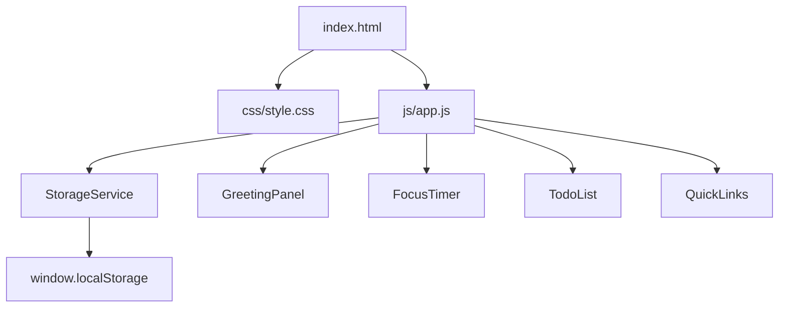
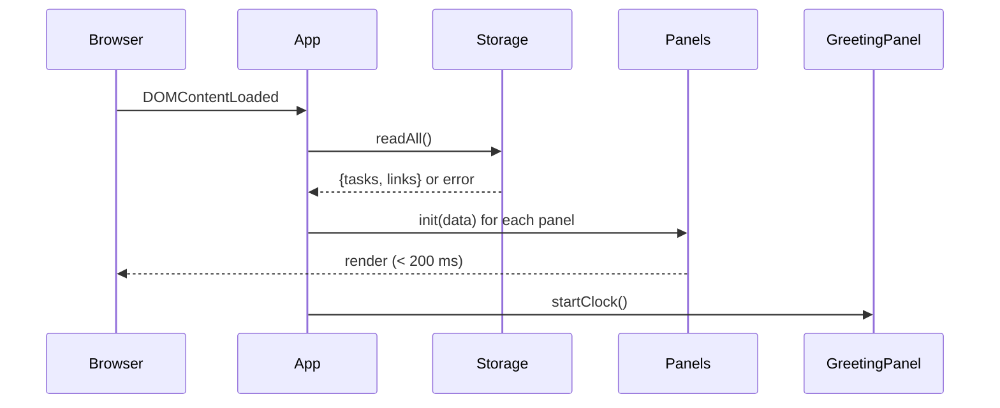
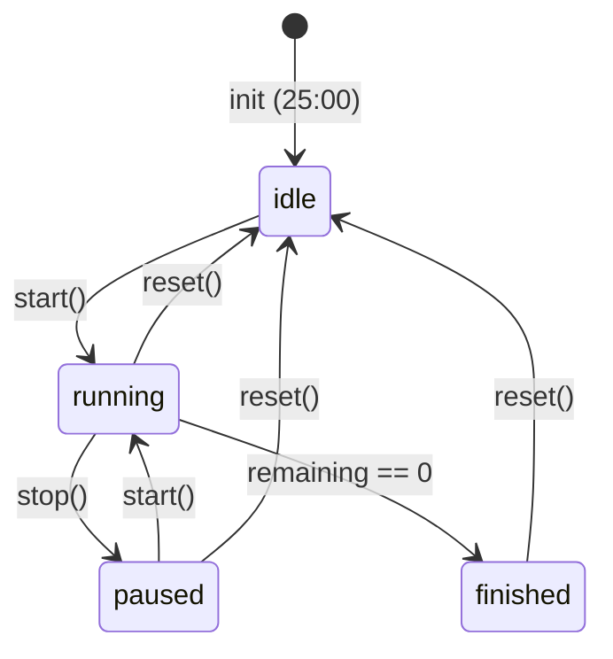

# Design Document: To-do List Life Dashboard

## Overview

The To-do List Life Dashboard is a single-page, client-side web application built exclusively with HTML, CSS, and vanilla JavaScript. It serves as a personal productivity hub combining four panels: a time-aware Greeting Panel, a Pomodoro-style Focus Timer, a persistent Todo List, and a customizable Quick Links panel.

All state is persisted in the browser's `localStorage` API. No backend, no frameworks, no external dependencies — the app functions as a standalone HTML file or packaged as a browser extension.

**Key design goals:**
- Zero dependencies beyond the browser runtime
- Instant UI responsiveness (< 100 ms for all interactions)
- All data survives page reloads via Local Storage
- Works across Chrome, Firefox, Edge, and Safari
- Responsive from 320 px to 2560 px wide

---

## Architecture

The application uses a **single-file HTML entry point** with two satellite files: one CSS and one JavaScript. All logic lives in `js/app.js`; all presentation in `css/style.css`.

### Module Structure (within `js/app.js`)

Because the constraint is a single JS file, the code is organized into clearly separated logical sections using an IIFE (Immediately Invoked Function Expression) wrapper with a module-like structure via plain JavaScript objects/closures.

```
js/app.js
├── StorageService       — read/write localStorage with error handling
├── GreetingPanel        — clock, date, time-based greeting logic
├── FocusTimer           — countdown timer state machine
├── TodoList             — task CRUD, persistence, rendering
├── QuickLinks           — link CRUD, persistence, rendering
└── App (init)           — bootstrap, wires up all panels
```

```
css/style.css
├── Reset / base styles
├── Layout (grid/flexbox dashboard)
├── Panel shared styles
├── Greeting Panel styles
├── Focus Timer styles
├── Todo List styles
├── Quick Links styles
└── Responsive breakpoints (< 768 px stack layout)
```

### Architectural Pattern

**Event-driven, imperative DOM manipulation** — no virtual DOM, no reactive framework. Each panel module exposes an `init(container)` function and manages its own DOM subtree. Communication between panels is not required; each is fully self-contained.



### Initialization Sequence



---

## Components and Interfaces

### StorageService

Centralizes all `localStorage` access. Every read/write is wrapped in a try/catch so callers never crash on storage errors.

```javascript
StorageService = {
  KEYS: {
    TASKS: 'tld_tasks',   // JSON array of Task objects
    LINKS: 'tld_links'    // JSON array of Link objects
  },

  // Returns parsed value or null on error/missing
  read(key): any | null,

  // Returns true on success, false on failure
  write(key, value): boolean,

  // Clears a specific key
  clear(key): void
}
```

**Error contract:** `read` returns `null` when the key is missing, when `localStorage` is unavailable, or when the stored value fails JSON parsing (and clears the malformed entry). `write` returns `false` when `localStorage` is unavailable or quota is exceeded.

---

### GreetingPanel

Owns the `#greeting-panel` DOM node.

```javascript
GreetingPanel = {
  init(container: HTMLElement): void,
  // Starts setInterval(1000) clock
  startClock(): void,
  // Updates only the time element — no full re-render
  _tick(): void,
  // Returns greeting string for a given hour (0–23)
  _getGreeting(hour: number): string
}
```

**Time boundary logic:**

| Hour range | Message |
|---|---|
| 05 – 11 | "Good Morning 🌅" |
| 12 – 17 | "Good Afternoon ☀️" |
| 18 – 21 | "Good Evening 🌇" |
| 22 – 04 | "Good Night 🌙" |

Each `_tick()` call re-evaluates the greeting and updates the greeting element only if the message changed, minimizing unnecessary DOM writes.

---

### FocusTimer

Owns the `#focus-timer` DOM node. Implements a finite state machine.

```javascript
FocusTimer = {
  // States: 'idle' | 'running' | 'paused' | 'finished'
  state: 'idle',
  remaining: 1500,  // seconds (25 * 60)

  init(container: HTMLElement): void,
  start(): void,
  stop(): void,   // pause
  reset(): void,
  _tick(): void,  // called by setInterval
  _formatTime(seconds: number): string,  // returns 'MM:SS'
  _render(): void,
  _updateControls(): void,
  _onFinish(): void  // plays audio + shows notification
}
```

**State machine:**



**Control enable/disable rules:**

| State | Start | Stop | Reset |
|---|---|---|---|
| idle | ✅ | ❌ | ❌ |
| running | ❌ | ✅ | ✅ |
| paused | ✅ | ❌ | ✅ |
| finished | ❌ | ❌ | ✅ |

The audio alert uses the Web Audio API (`AudioContext`) to generate a short beep, avoiding any external audio file dependency.

---

### TodoList

Owns the `#todo-list` DOM node. Manages an in-memory array of `Task` objects and syncs to storage on every mutation.

```javascript
TodoList = {
  tasks: Task[],  // in-memory source of truth

  init(container: HTMLElement, initialTasks: Task[]): void,
  addTask(description: string): Result,
  editTask(id: string, newDescription: string): Result,
  toggleComplete(id: string): Result,
  deleteTask(id: string): Result,
  _persist(): boolean,        // writes tasks to StorageService
  _renderAll(): void,
  _renderTask(task: Task): HTMLElement,
  _showError(message: string): void
}
```

**Validation rules:**
- Add: description must be 1–255 characters after trim
- Edit: trimmed value must be 1–500 characters
- Both: whitespace-only → rejected

---

### QuickLinks

Owns the `#quick-links` DOM node. Manages an in-memory array of `Link` objects.

```javascript
QuickLinks = {
  links: Link[],

  init(container: HTMLElement, initialLinks: Link[]): void,
  addLink(label: string, url: string): Result,
  deleteLink(id: string): Result,
  _persist(): boolean,
  _renderAll(): void,
  _renderLink(link: Link): HTMLElement,
  _validateUrl(url: string): boolean,  // must start with http:// or https://
  _showError(message: string): void
}
```

**Delete flow:** The delete control triggers a `window.confirm()` dialog for confirmation (Requirement 9.4). On confirm, the link is removed and `_persist()` is called. If persist fails, the link is restored to its previous position.

---

## Data Models

### Task

```javascript
{
  id: string,          // crypto.randomUUID() or Date.now() fallback
  description: string, // 1–255 chars (add), 1–500 chars (edit)
  completed: boolean,  // false on creation
  createdAt: number    // Date.now() timestamp
}
```

**Storage key:** `tld_tasks`  
**Storage format:** `JSON.stringify(Task[])`

### Link

```javascript
{
  id: string,    // crypto.randomUUID() or Date.now() fallback
  label: string, // 1–50 chars (display label)
  url: string    // 1–2048 chars, must begin with http:// or https://
}
```

**Storage key:** `tld_links`  
**Storage format:** `JSON.stringify(Link[])`

### Storage Layout

| Key | Type | Content |
|---|---|---|
| `tld_tasks` | `string` | JSON-serialized `Task[]` |
| `tld_links` | `string` | JSON-serialized `Link[]` |

### ID Generation

```javascript
function generateId() {
  if (typeof crypto !== 'undefined' && crypto.randomUUID) {
    return crypto.randomUUID();
  }
  // Fallback for older browsers
  return Date.now().toString(36) + Math.random().toString(36).slice(2);
}
```

---

## Correctness Properties

*A property is a characteristic or behavior that should hold true across all valid executions of a system — essentially, a formal statement about what the system should do. Properties serve as the bridge between human-readable specifications and machine-verifiable correctness guarantees.*

### Property 1: Task addition round-trip

*For any* valid task description (1–255 characters, not whitespace-only), adding it to the task list and then reading the list back from Storage should produce a list that contains a task with the same description and a `completed` status of `false`.

**Validates: Requirements 4.2, 4.3**

---

### Property 2: Whitespace-only task descriptions are always rejected

*For any* string composed entirely of whitespace characters (spaces, tabs, newlines), attempting to add it as a task description should leave the task list unchanged and the list length should remain the same.

**Validates: Requirements 4.4**

---

### Property 3: Task toggle is its own inverse (round-trip)

*For any* task list and any task in that list, toggling the task's completion status twice should return the task to its exact original completion status, and the total list length should remain unchanged throughout.

**Validates: Requirements 6.2, 6.3**

---

### Property 4: Task deletion shrinks the list by exactly one

*For any* non-empty task list, deleting any single task should produce a list with exactly one fewer element, and no task in the resulting list should have the same `id` as the deleted task.

**Validates: Requirements 6.7**

---

### Property 5: Task serialization round-trip

*For any* array of `Task` objects (in any order), serializing the array to JSON and then deserializing it should produce an array where each task's `id`, `description`, `completed`, and `createdAt` fields are identical to the originals and the order is preserved.

**Validates: Requirements 7.1, 7.2**

---

### Property 6: Link serialization round-trip

*For any* array of `Link` objects (in any order), serializing the array to JSON and then deserializing it should produce an array where each link's `id`, `label`, and `url` fields are identical to the originals and the order is preserved.

**Validates: Requirements 10.1, 10.2**

---

### Property 7: URL validation is total and consistent

*For any* string that does not begin with `http://` or `https://` (including empty strings, `ftp://` URLs, or plain hostnames), `_validateUrl` should return `false`. *For any* string that begins with `http://` or `https://` and has total length between 1 and 2048 characters, `_validateUrl` should return `true`.

**Validates: Requirements 8.2, 8.6**

---

### Property 8: Greeting function covers all 24 hours without gaps

*For any* integer hour in the range 0–23, `_getGreeting(hour)` should return exactly one of the four defined greeting strings ("Good Morning 🌅", "Good Afternoon ☀️", "Good Evening 🌇", "Good Night 🌙"), and calling it twice with the same input should return the same string (determinism).

**Validates: Requirements 2.3, 2.4, 2.5, 2.6**

---

### Property 9: Task edit preserves identity and trims whitespace

*For any* task in the list and any new description string whose trimmed value is 1–500 characters long, editing the task should preserve its `id`, `completed`, and `createdAt` fields unchanged, and the stored `description` should equal the trimmed input value.

**Validates: Requirements 5.3**

---

### Property 10: Whitespace-only edit leaves task unchanged

*For any* task in the list, confirming an edit with any whitespace-only string should leave the task's `description` field unchanged, and the Storage content should reflect no change to that task.

**Validates: Requirements 5.4**

---

### Property 11: Timer format function produces valid MM:SS for all valid inputs

*For any* integer number of remaining seconds in the range 0–1500 (inclusive), `_formatTime(seconds)` should return a string matching the pattern `MM:SS` where MM is zero-padded minutes (00–24) and SS is zero-padded seconds (00–59), and the numeric value of `MM * 60 + SS` should equal the input.

**Validates: Requirements 3.3**

---

## Error Handling

### Storage Unavailability

All `localStorage` calls are wrapped in try/catch within `StorageService`. The error handling strategy follows a "fail gracefully" principle: the app always renders and stays usable; it just cannot persist.

| Scenario | Behavior |
|---|---|
| Storage unavailable on load | Render all panels in default empty state; show global error banner |
| Storage write fails on task add | Task is added in memory; error message shown to user |
| Storage write fails on task delete | Task is restored to list; error message shown |
| Storage write fails on completion toggle | Toggle is preserved in memory; error message shown |
| Storage write fails on link add | Link is removed from panel; error message shown |
| Storage write fails on link delete | Link is restored to panel; error message shown |
| Malformed JSON in storage (tasks) | Clear `tld_tasks` key; render empty task list; no error shown |
| Malformed JSON in storage (links) | Clear `tld_links` key; render empty links panel; no error shown |

### Input Validation Errors

All validation errors are displayed as inline error messages adjacent to the relevant input field. Error messages are cleared when the user begins a new interaction with that input.

| Trigger | Message |
|---|---|
| Empty/whitespace task description (add) | "Task description cannot be empty." |
| Task description > 255 chars (add) | "Task description cannot exceed 255 characters." |
| Empty/whitespace task description (edit) | "Task description cannot be empty." |
| Task description > 500 chars (edit) | "Task description cannot exceed 500 characters." |
| Empty link label | "Label is required." |
| Invalid/empty link URL | "A valid URL starting with http:// or https:// is required." |

### Focus Timer Audio Fallback

If `AudioContext` is unavailable (e.g., older browser, sandboxed extension context), the audible alert is silently skipped. The visual notification is always shown regardless of audio support.

### ID Generation Fallback

If `crypto.randomUUID` is unavailable, the `generateId()` fallback uses `Date.now()` + `Math.random()` which provides sufficient uniqueness for client-side use.

---

## Testing Strategy

### Overview

Because this is a pure vanilla JS, client-side application with no build tooling, the testing approach uses:

- **Unit tests**: [Jest](https://jestjs.io/) (v29) with [jsdom](https://github.com/jsdom/jsdom) to simulate the DOM and `localStorage`
- **Property-based tests**: [fast-check](https://github.com/dubzzz/fast-check) (v3) for universally quantified properties
- **Manual / exploratory testing**: For visual rendering, responsive layout, audio alerts, and cross-browser compatibility

### Unit Tests

Unit tests cover specific examples, edge cases, and integration points. Avoid writing redundant examples for behaviors already covered by property tests.

**StorageService:**
- Returns `null` when key is missing
- Returns `null` and clears key when stored value is malformed JSON
- Returns `false` when `localStorage.setItem` throws a quota error

**GreetingPanel:**
- `_getGreeting(4)` → "Good Night 🌙" (boundary: hour 4)
- `_getGreeting(5)` → "Good Morning 🌅" (boundary: hour 5)
- `_getGreeting(11)` → "Good Morning 🌅" (boundary: hour 11)
- `_getGreeting(12)` → "Good Afternoon ☀️" (boundary: hour 12)
- `_getGreeting(17)` → "Good Afternoon ☀️" (boundary: hour 17)
- `_getGreeting(18)` → "Good Evening 🌇" (boundary: hour 18)
- `_getGreeting(21)` → "Good Evening 🌇" (boundary: hour 21)
- `_getGreeting(22)` → "Good Night 🌙" (boundary: hour 22)
- `_tick()` updates only the time element, not the greeting element, when the hour hasn't changed

**FocusTimer:**
- Starts in `idle` state with `remaining = 1500`
- State: idle → running on `start()`
- State: running → paused on `stop()`
- State: paused → running on `start()` (resumes from retained time)
- State: running → idle on `reset()`; remaining resets to 1500
- State: running → finished when remaining reaches 0
- Start disabled in running/finished states; Stop disabled in idle/paused/finished states
- `_formatTime(0)` → "00:00"
- `_formatTime(1500)` → "25:00"
- `_formatTime(90)` → "01:30"

**TodoList:**
- Adding a task with exactly 255 characters succeeds
- Adding a task with 256 characters fails with the correct error message
- Editing a task with exactly 500 characters succeeds
- Editing with whitespace-only value restores the original description
- Storage failure on add: task present in memory, not in storage mock

**QuickLinks:**
- `"http://example.com"` accepted
- `"https://example.com"` accepted
- `"ftp://example.com"` rejected
- `""` rejected
- `"example.com"` rejected
- Storage failure on add: link removed from panel

### Property-Based Tests

Use **fast-check** v3 with a minimum of **100 runs per property**. Each test is annotated with a comment referencing its design document property.

```javascript
// Feature: todo-life-dashboard, Property N: <property_text>
```

**Property 1 — Task addition round-trip**
- Generator: `fc.string({ minLength: 1, maxLength: 255 })` filtered to exclude whitespace-only strings
- Assert: after `addTask(desc)`, `StorageService.read(KEYS.TASKS)` contains a task with matching description and `completed === false`
- Validates: Requirements 4.2, 4.3

**Property 2 — Whitespace task descriptions always rejected**
- Generator: `fc.stringOf(fc.constantFrom(' ', '\t', '\n', '\r'), { minLength: 1 })`
- Assert: `addTask(ws)` returns a failure result; list length unchanged; storage unchanged
- Validates: Requirements 4.4

**Property 3 — Task toggle is its own inverse**
- Generator: `fc.array(taskArbitrary, { minLength: 1 })` + `fc.integer` index
- Assert: after `toggleComplete(id)` twice, `tasks[i].completed === original`; list length unchanged
- Validates: Requirements 6.2, 6.3

**Property 4 — Task deletion shrinks list by exactly one**
- Generator: `fc.array(taskArbitrary, { minLength: 1 })` + valid index
- Assert: after `deleteTask(id)`, list has `original.length - 1` elements; no remaining task has the deleted `id`
- Validates: Requirements 6.7

**Property 5 — Task serialization round-trip**
- Generator: `fc.array(taskArbitrary)`
- Assert: `JSON.parse(JSON.stringify(tasks))` produces tasks with identical `id`, `description`, `completed`, `createdAt`; order preserved
- Validates: Requirements 7.1, 7.2

**Property 6 — Link serialization round-trip**
- Generator: `fc.array(linkArbitrary)`
- Assert: `JSON.parse(JSON.stringify(links))` produces links with identical `id`, `label`, `url`; order preserved
- Validates: Requirements 10.1, 10.2

**Property 7 — URL validation is total**
- Generator A: `fc.string()` filtered to NOT start with `http://` or `https://` → `_validateUrl` must return `false`
- Generator B: `fc.oneof(fc.constant('http://'), fc.constant('https://'))` concatenated with `fc.string({ minLength: 1, maxLength: 2040 })` → `_validateUrl` must return `true`
- Validates: Requirements 8.2, 8.6

**Property 8 — Greeting covers all 24 hours without gaps**
- Generator: `fc.integer({ min: 0, max: 23 })`
- Assert: result is one of exactly four defined strings; same input always returns same string (determinism)
- Validates: Requirements 2.3, 2.4, 2.5, 2.6

**Property 9 — Task edit preserves identity and trims whitespace**
- Generator: `taskArbitrary` + `fc.string({ minLength: 1, maxLength: 500 })` filtered so trimmed length ≥ 1
- Assert: after `editTask(id, input)`, task `id`, `completed`, `createdAt` unchanged; `description === input.trim()`
- Validates: Requirements 5.3

**Property 10 — Whitespace-only edit leaves task unchanged**
- Generator: `taskArbitrary` + `fc.stringOf(fc.constantFrom(' ', '\t', '\n', '\r'), { minLength: 1 })`
- Assert: `editTask(id, ws)` returns failure; task `description` unchanged; storage unchanged
- Validates: Requirements 5.4

**Property 11 — Timer format function produces valid MM:SS for all valid inputs**
- Generator: `fc.integer({ min: 0, max: 1500 })`
- Assert: `_formatTime(s)` matches `/^\d{2}:\d{2}$/`; parsed `MM * 60 + SS === s`; MM in range 00–25; SS in range 00–59
- Validates: Requirements 3.3

### Manual / Exploratory Testing

The following require visual inspection or a real browser environment and are not covered by automated tests:

| Area | What to check |
|---|---|
| Responsive layout | All panels render correctly at 320 px, 768 px, 1440 px, 2560 px viewports |
| Accessibility | Contrast ratio ≥ 4.5:1 using browser accessibility tools; font size ≥ 14 px |
| Cross-browser | Chrome, Firefox, Edge, Safari — all four panels render, data persists |
| Timer audio | Beep sounds on timer completion; graceful silence when AudioContext unavailable |
| Link deletion confirm | `window.confirm()` dialog appears; cancel retains link |
| Performance | Initial load < 2 s; interaction feedback < 100 ms (DevTools Performance panel) |
| Loading indicator | Visible within 500 ms if load exceeds 2 s |
| Browser extension | Packaged extension opens as popup; all panels functional |
